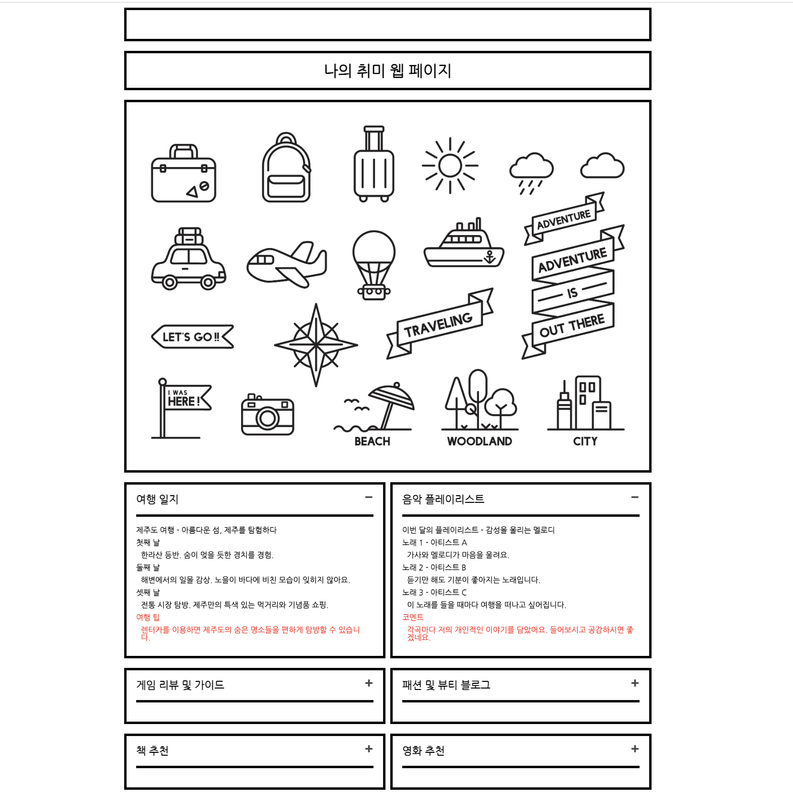

# 개인 취미 웹 페이지 프로젝트 - JS편

  

이 프로젝트는 HTML, CSS 기초에 이어 Javascript를 기초적인 내용을 다루며, 이전에 배웠던 웹 페이지의 스타일과 레이아웃을 개선에 이어서 간단한 기능(javascript)를 활용하여 개인의 취미와 관심사를 돋보이게 표현하는 웹 사이트를 만드는 기술을 습득합니다.

## 프로젝트 목표

## 결론
